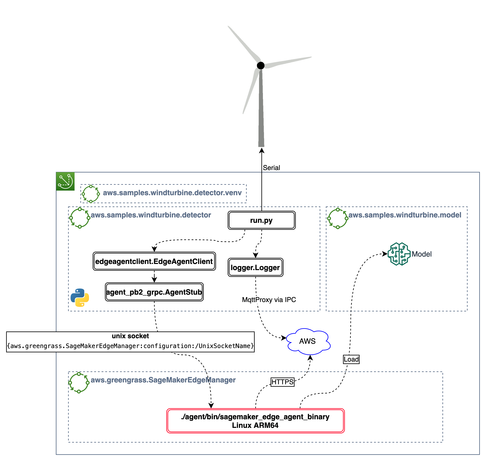

# Edge application

This is a Python application that runs on the Edge device. It connects all the components together and is responsible for the loop that reads the sensors data, prepare the data, invoke the ML model and report back to the cloud metrics and logs.

This is the reference architecture of this application:


The application has some Python modules responsible for:
 - **run.py**: main application that launches all the other components
 - **EdgeAgentClient**: client that communicates with SageMaker Edge Agent, using protobuf/gRPC
 - **AgentStubs**: Python stubs generated by the protobuf compiler
 - **Logger**: module responsible for buffering application logs and then sending this data to the cloud via Greengrass MQTT connection

The application code, the libraries needed by the application, the model and the SageMaker Edge Manager agent are all delivered as Greengrass components to the device. This allow to easily manage these components independently and enable OTA updates for all of them.


## Create the application
This application is packaged as 2 Greengrass components that can be executed on Greengrass v2 enabled devices:
1. The `aws.samples.windturbine.detector.venv` component creates a Python virtual environment and install all the Python modules necessary for the application
1. The `aws.samples.windturbine.detector` component deploys the code artifacts and runs them in the virtual environment

To create the components in your own account do the following:

1. Open the [AWS Console](https://eu-west-1.console.aws.amazon.com/iot/home?region=eu-west-1#/greengrass/v2/components/create) 
1. Select **Enter recipe as YAML** and copy paste the content of the `aws.samples.windturbine.detector.venv-recipe.yaml` file
1. Click on **Create component**
1. Open a shell on you computer and create a zip file with the application 
   ```bash
   cd 04_EdgeApplication/artifacts/aws.samples.windturbine.detector/1.0.0
   zip ../../../detector.zip -D -r .
   cd ../../..
   ```
1. Upload the `detector.zip` file to an S3 bucket in the same region where you are configuring Greengrass. You can use the console or the following command line if you have credentials on you machine. If you do not have a bucket, you can create one 
   ```bash
   export BUCKET=<bucket>
   aws s3 cp detector.zip s3://$BUCKET/aws.samples.windturbine.detector/1.0.0/detector.zip
   ```
1. Open the [AWS Console](https://console.aws.amazon.com/iot/home?#/greengrass/v2/components/create) 
1. Select **Enter recipe as YAML** and copy paste the content of the `aws.samples.windturbine.detector-recipe.yaml` file
1. Update the `Uri:`value in the recipe file `aws.samples.windturbine.detector-recipe.yaml` with the S3 path to the `detector.zip`. If you used the CLI command above this would be `s3://<bucket>/aws.samples.windturbine.detector/1.0.0/detector.zip`
1. Click on **Create component**

Now that the component has been created, we proceed by installing Greengrass on the Jetson Nano and then deploy the application to the device.

### Create IAM Role
The automatic installer creates the necessary cloud resources and for this it needs IAM credentials.  

First we need to create an IAM role with the permissions to create the necessary resources. If you have already a role you can skip this step. You can find extended instructions at (https://docs.aws.amazon.com/IAM/latest/UserGuide/id_roles_create_for-user.html)


Open an [AWS CloudShell](https://console.aws.amazon.com/cloudshell) and run the following command to create the role. Replace `XXXX` with your account number (run `aws sts get-caller-identity` to obtain it)

```bash
aws iam create-role --role-name GreengrassInstallerRole --assume-role-policy-document "{\"Version\":\"2012-10-17\",\"Statement\":[{\"Effect\":\"Allow\",\"Principal\":{\"AWS\":\"arn:aws:iam::XXXX:root\"},\"Action\":\"sts:AssumeRole\",\"Condition\":{}}]}"
```
and this command to attach an inline policy with the [correct permissions](https://docs.aws.amazon.com/greengrass/v2/developerguide/provision-minimal-iam-policy.html)

```bash
aws iam put-role-policy --role-name GreengrassInstallerRole --policy-name GreengrassInstallerPolicy --policy-document "{\"Version\":\"2012-10-17\",\"Statement\":[{\"Effect\":\"Allow\",\"Action\":[\"iot:AddThingToThingGroup\",\"iot:AttachPolicy\",\"iot:AttachThingPrincipal\",\"iot:CreateKeysAndCertificate\",\"iot:CreatePolicy\",\"iot:CreateRoleAlias\",\"iot:CreateThing\",\"iot:CreateThingGroup\",\"iot:DescribeEndpoint\",\"iot:DescribeRoleAlias\",\"iot:DescribeThingGroup\",\"iot:GetPolicy\",\"iam:GetRole\",\"iam:CreateRole\",\"iam:PassRole\",\"iam:CreatePolicy\",\"iam:AttachRolePolicy\",\"iam:GetPolicy\",\"sts:GetCallerIdentity\"],\"Resource\":\"*\"},{\"Sid\":\"DeployDevTools\",\"Effect\":\"Allow\",\"Action\":[\"greengrass:CreateDeployment\",\"iot:CancelJob\",\"iot:CreateJob\",\"iot:DeleteThingShadow\",\"iot:DescribeJob\",\"iot:DescribeThing\",\"iot:DescribeThingGroup\",\"iot:GetThingShadow\",\"iot:UpdateJob\",\"iot:UpdateThingShadow\"],\"Resource\":\"*\"}]}"
```

Finally run:
```bash
creds=$(aws sts assume-role --role-arn $(aws iam get-role --role-name GreengrassInstallerRole --query "Role.Arn" --out text) --role-session-name installGreengrass)
echo "==========
export AWS_ACCESS_KEY_ID=$(echo $creds | jq .Credentials.AccessKeyId)
export AWS_SECRET_ACCESS_KEY=$(echo $creds | jq .Credentials.SecretAccessKey)
export AWS_SESSION_TOKEN=$(echo $creds | jq .Credentials.SessionToken)
=========="

```

Copy the text in between the two `=======` separators in an editor.

## Install Greengrass 

1. Connect to you Jetson Nano via an SSH session. 
1. Paste the text you previously copied from the AWS CloudShell session. This will provide the credentials to the shell to create the necessary cloud resources during the installation process
1. Ensure the necessary pre-requisites are available on the device. Java and zip are required by Greengrass, while Python is required by the application.
   ```bash
   wget -O- https://apt.corretto.aws/corretto.key | sudo apt-key add - 
   sudo add-apt-repository 'deb https://apt.corretto.aws stable main'
   sudo apt-get update; sudo apt-get install -y java-15-amazon-corretto-jdk python3 python3-pip python3-venv zip curl
   ``` 
1. Download the Greengrass software
   ```bash
   curl -s https://d2s8p88vqu9w66.cloudfront.net/releases/greengrass-nucleus-latest.zip > greengrass-nucleus-latest.zip && unzip greengrass-nucleus-latest.zip -d GreengrassCore
   ```


1. Run (replace the region in `--aws-region eu-west-1` with the region you are using). Note that we run the components with a default user `ggc_user` and group `video`. Group `video` is required to access the CUDA device on the Jetson.
   ```bash
   sudo -E java -Droot="/greengrass/v2" -Dlog.store=FILE -jar ./GreengrassCore/lib/Greengrass.jar --thing-name JetsonNanoTurbine1 --thing-group-name windturbines --component-default-user ggc_user:video --provision true --setup-system-service true --deploy-dev-tools true --tes-role-name SagemakerTESRole --tes-role-alias-name SagemakerTESRoleAlias --aws-region eu-west-1 
   ```
After the installer has run, Greengrass will be running as system service on the device and a Core Device called `JetsonNanoTurbine1` associated to the thing groups `windturbines` has been created in the account.

## Setup SageMaker Edge Manager

SageMaker Edge Manager manages devices through fleets. A fleet is a logical collection of devices and help in collect and analyzing data.


### Update the Greengrass Device role

In order to allow the component running in Greengrass to communicate with SageMaker Edge, we need to add the following permissions to the IAM role that is used by the Token Exchange Server.

In the AWS console, navigate to the [IAM service](https://console.aws.amazon.com/iam), select `Roles` from the menu on the left and search for the role `SageMakerTESRole`.

1. Click on the role name and then **Attach policies**
1. Search for `AmazonSageMakerEdgeDeviceFleetPolicy` and select it
1. Click on **Attach policy**

> Make note of the Role ARN as we need this to setup the SageMaker Edge device fleet


## Create the SageMaker Edge device fleet

1. Open the [Amazon SageMaker console](https://console.aws.amazon.com/sagemaker/) 
1. Select **Edge Manager** from the menu on the left
1. Select **Edge device fleets**
1. Click on **Create device fleet**
1. Enter a name for the fleet, e.g. `windturbines`
1. Enter the IAM Role ARN you noted earlier (should end with `SageMakerTESRole`)
1. Click **Next**
1. Enter the S3 bucket name you noted down as the last step in the Jupyter notebook prefixed with `s3://`
1. Click **Submit**

## Deploy SageMaker Edge Manager component

The SageMaker Edge Manager component must be configured before being deployed to the device. Follow these steps to deploy the component to the Jetson Nano:

1. In the [components console](https://console.aws.amazon.com/iot/home?#/greengrass/v2/components) select the [aws.greengrass.SageMakerEdgeManager](https://console.aws.amazon.com/iot/home?#/greengrass/v2/components/public/aws.greengrass.SageMakerEdgeManager) component.
1. Click on **Deploy**
1. Select **Add to existing deployment** and select the deployment for your device, **Deployment for windturbines**
1. Click on **Next** until you get to the page **Configure components - _optional_**
1. Select the **aws.greengrass.SageMakerEdgeManager** component and click on **Configure component**
1. In the **Component version** drop down select `Version: 1.0.2`
1. In the **Configuration update** section replace the **Configuration to merge** with the following:
```json
{
  "DeviceFleetName": "windturbines",
  "BucketName": "<inference-bucket>"
}
```
The _inference-bucket_ is the same bucket you configured when you have created the SageMaker Edge [device fleet](https://console.aws.amazon.com/sagemaker/home?#/edge-device-fleets/WindTurbineFarm)
1. Click **Confirm**
1. Click **Next** until you get to the **Review** page
1. Scroll to the bottom of the page and click **Deploy**

## Deploy the application

1. In the [components console](https://console.aws.amazon.com/iot/home?#/greengrass/v2/components) select the component [aws.samples.windturbine.detector](https://console.aws.amazon.com/iot/home?#/greengrass/v2/components/private/aws.samples.windturbine.detector)
1. Click on **Deploy**
1. Select **Add to existing deployment** and select the deployment for your device, **Deployment for windturbines**
1. Click **Next** until you get to the **Review** page
1. Scroll to the bottom of the page and click **Deploy**

This will deploy the component in test mode which allows you to test the application even if you do not have a physical turbine attached to the Jetson Nano. The application will download a dummy file and use it as the sensors readings. You don't need the real wind turbines connected to the edge device in this mode.

To run it with a real turbine, repeat the process above. When you get to the **Configure components - _optional_** screen, select the `aws.samples.windturbine.detector` component and then click on **Configure component**.

In the configuration page, replace the **Configuration merge** entry with

```json
{
    "FLAGS": "--debug"
}
```

(`--debug` will print some more detailed logging that might help you with troubleshooting in case something is wrong. It can be omitted)

Click **Save**, and then proceed until you get to the review screen and deploy the configuration.


## Reports/dashboards

[Find here](/04_EdgeApplication/report) instructions to plug your wind turbine farm application to a report tool. You'll see how to use Elasticsearch/Kibana or AWS CloudWatch to visualize anomalies and other info related to your turbines.

