## Building your own mini wind turbine

A Mini Wind Turbine is composed by 3D printed parts and some electronic components. It is static, which means that it doesn't align itself with the wind direction.
Also, it requires an USB cable for energy and data transfer.

  <table border="0" align="center">
    <tr>
      <td>
        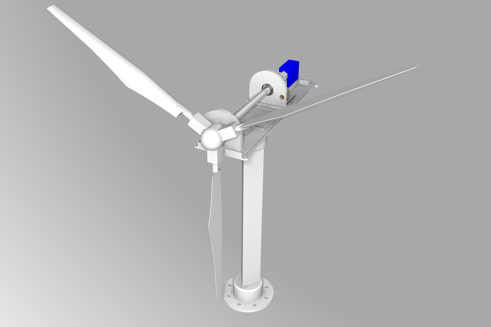</img>
      </td>
      <td>
        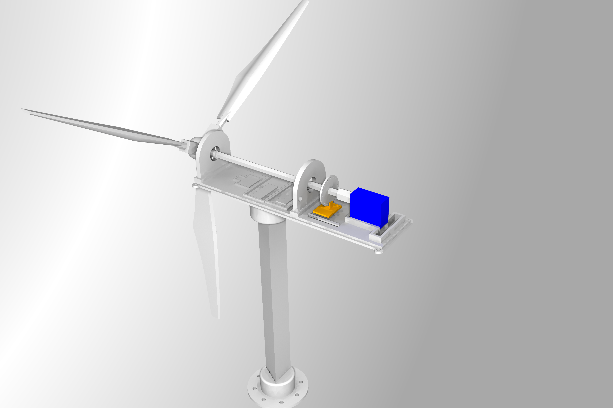</img>
      </td>
    </tr>
  </table>  

Get and 3D print the following parts:
  - [Shaft](01_3DModels/stl/big_shaft.stl)
  - [Servo/Generator Shaft](01_3DModels/stl/servo_shaft.stl)
  - [Body Cover](01_3DModels/stl/body_cover.stl)
  - [Body Support](01_3DModels/stl/body_support_static.stl)
  - [Box Base](01_3DModels/stl/box_base.stl)
  - [Blade x3](01_3DModels/stl/full_blade.stl)  
  - [Light Disc](01_3DModels/stl/light_disc.stl)
  - [Light Sensor Support](01_3DModels/stl/light_sensor_support.stl)
  - [MPU Support](01_3DModels/stl/mpu_support.stl)
  - [Pillar A](01_3DModels/stl/pillar_a.stl)
  - [Pillar B](01_3DModels/stl/pillar_b.stl)
  - [Pole Base](01_3DModels/stl/pole_base.stl)
  - [Pole](01_3DModels/stl/pole_triangle.stl)
  - [Rotor Base](01_3DModels/stl/rotor_base.stl)
  - [Sensors Bed](01_3DModels/stl/sensors_bed.stl)
  - [Small Generator Connector](01_3DModels/stl/small_generator_connector.stl)

There is no PCB for this project. All the components are soldered with wires and glued (hot glue) to the turbine. Take a look on the following schematics:

  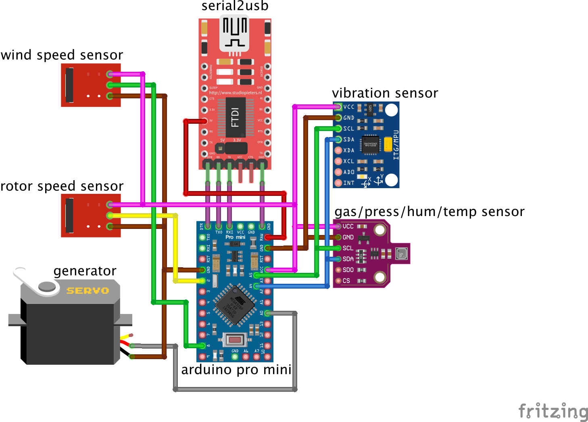</img>

As you can see, the turbine is based on **Arduini Mini Pro 3v3**. The other components are:
  - **BME680**: a sensor for temperature, air pressure, air quality and humidity
  - **MPU6050**: an (6axis) accelerometer + gyroscope used for vibration analisys
  - **FTDI generic USB to serial converter**: configured with 3v3v, but 5V is applied to the **RAW** (regulated) terminal of the Arduino
  - **Generator - Hacked servo 9G**: this is a common servo 9g without the driver board and with modified gears. **[Click here](SERVO_HACKING.md)** to see how to hack your servo.
  - **Speed Encoder - Photo interrupter [Keyes K-010](https://www.amazon.de/-/en/AZDelivery-Sensor-Parent-KY-Kit/dp/B07DQLPZYF/ref=sr_1_1?dchild=1&keywords=KY010&qid=1609958899&sr=8-1)**: To count how many rotations per second 
  - **F686ZZ Flanges Radial KUGELL Bearings/ [Shielded Flange Ball Bearing 6 x 13 x 5 mm](https://www.amazon.de/gp/product/B078R9JJDY/ref=ppx_yo_dt_b_asin_title_o04_s00?ie=UTF8&psc=1) x2**: two ball bearings to connect the shaft to the pillars.

  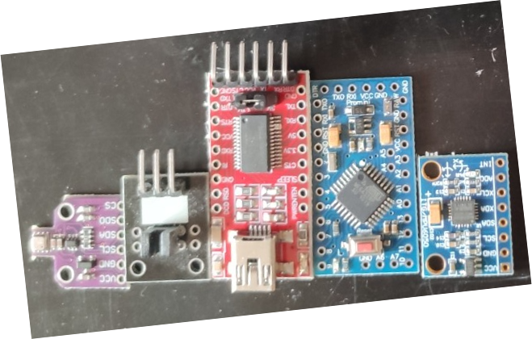</img>

 
Take a look on the pictures bellow to see how to put everything together. Use the schematics above to solder all the components. Just put pressure on some parts to attach them on each other. Use **hot glue** to fix the moving parts as shown in the pictures.
 
   <table border="0" align="center">
    <tr>
      <td>
        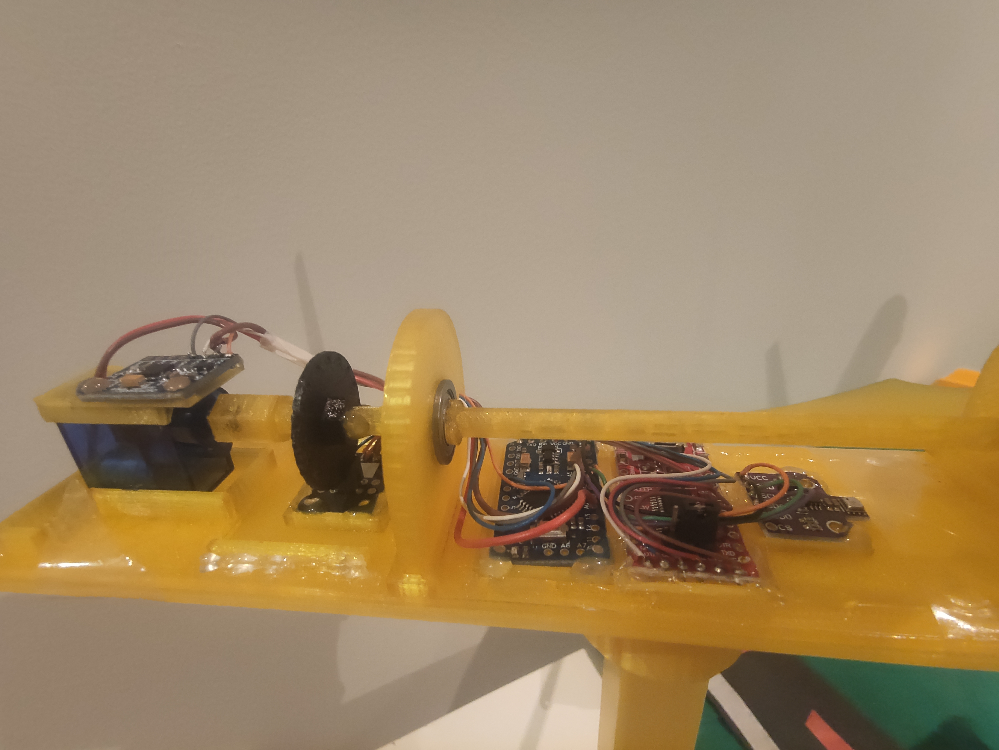</img>
      </td>
      <td>
        </img>
      </td>
      <td>
        </img>
      </td>
    </tr>
    <tr>
      <td>
        </img>
      </td>
      <td>
        </img>
      </td>
      <td>
        </img>
      </td>
    </tr>
    <tr>
      <td>
        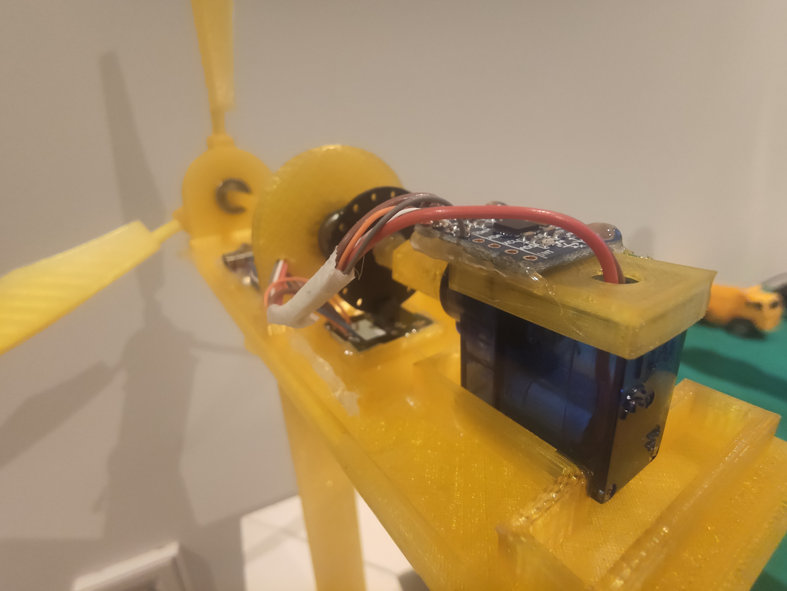</img>
      </td>
      <td>
        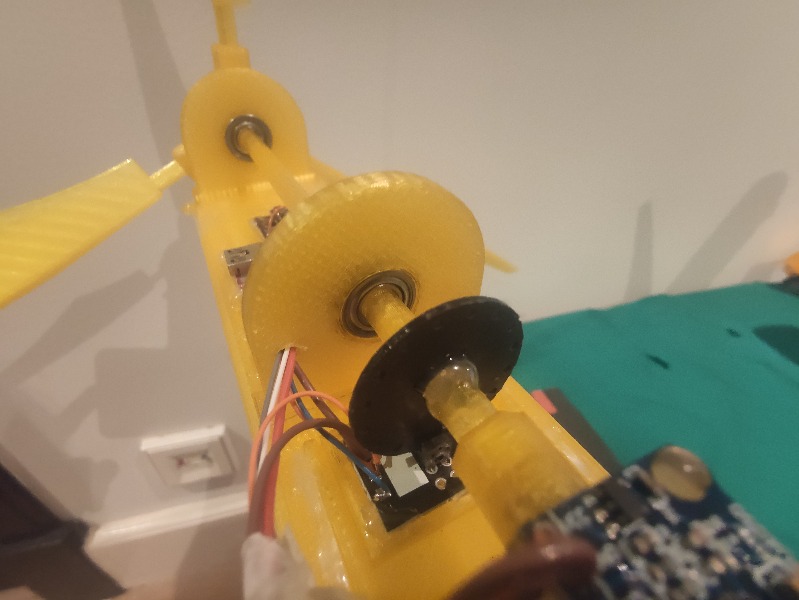</img>
      </td>
      <td>
        </img>
      </td>
    </tr>
  </table>  

After building your turbine, plug it to your computer and [follow these instructions](02_Firmware/README.md) to compile the firmware and flash it to the arduino. 

## Wind speed meter

You can also build your own wind speed meter, that can be attached to the top cover of the wind turbine. This is another sensor, required to analize the wind turbine performance and some potential anomalies. It uses the same infrared sensor to measure the speed of the turbine rotor. As you can see in the schematics, this sensor's signal is also read by Arduino and sent to your edge device through the same communication channel.

  <table border="0" align="center">
    <tr>
      <td>
        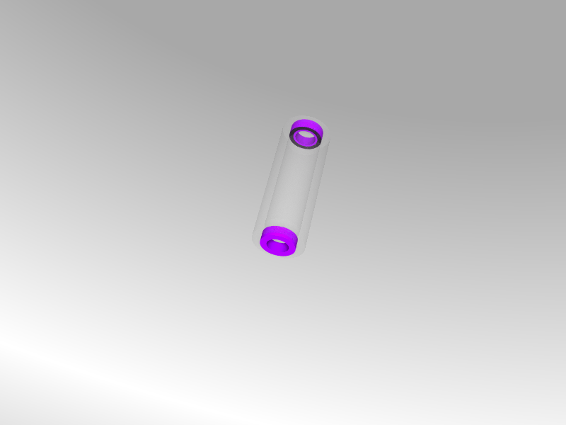</img>
      </td>
      <td>
        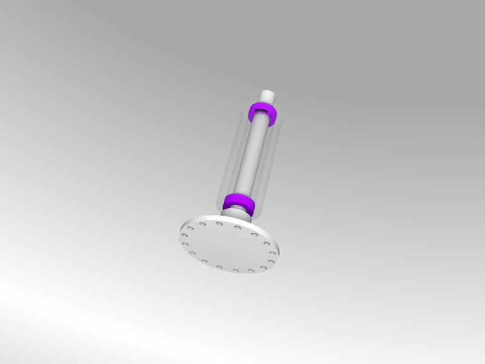</img>
      </td>
    </tr>
    <tr>
      <td>
        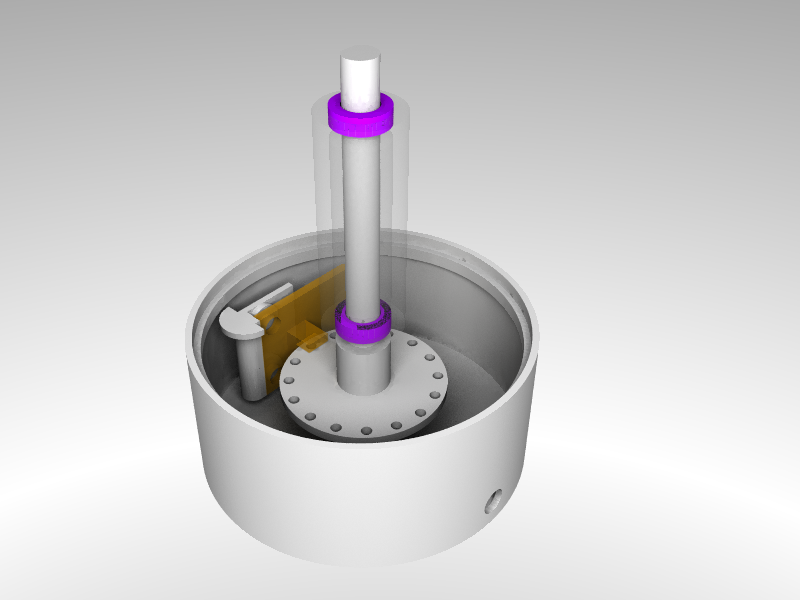</img>
      </td>
      <td>
        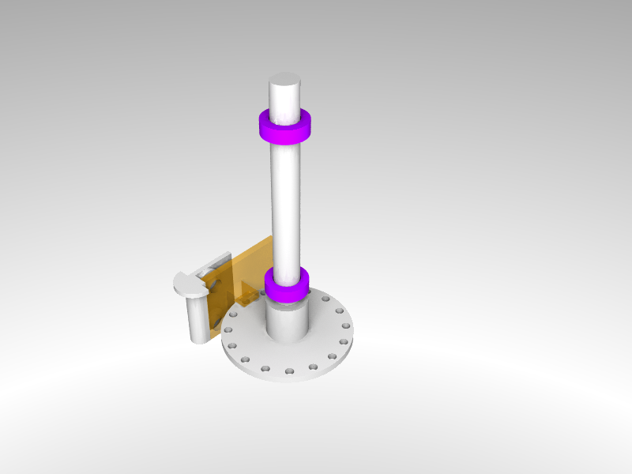</img>
      </td>
    </tr>
    <tr>
      <td>
        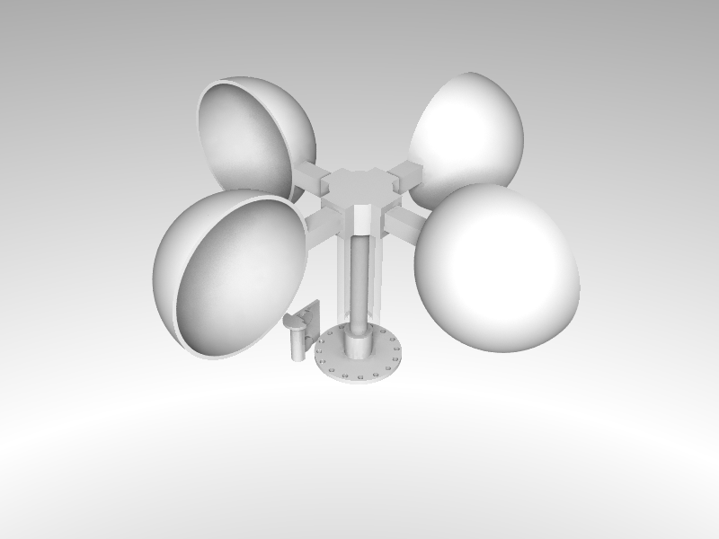</img>
      </td>
      <td>
        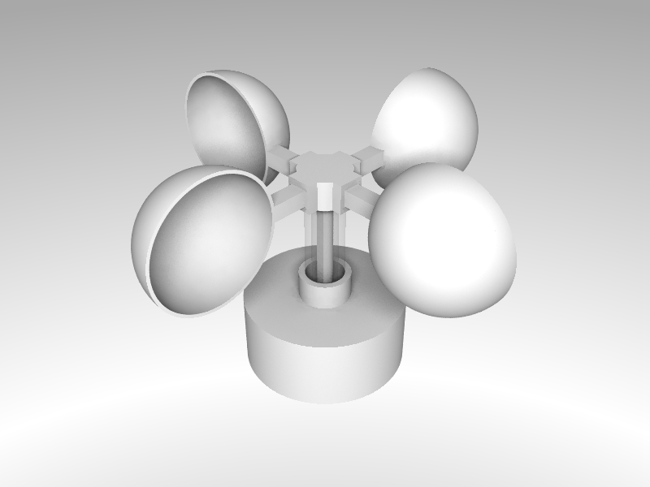</img>
      </td>
    </tr>
  </table>  

Get and 3D print the following parts:
 - [Rotor](01_3DModels/wind_speed_stl/rotor.stl)
 - [Box cover](01_3DModels/wind_speed_stl/box_cover.stl)
 - [Light encoder disc](01_3DModels/wind_speed_stl/light_disc.stl)
 - [Infrared sensor support](01_3DModels/wind_speed_stl/light_sensor_support.stl)
 - [Shaft](01_3DModels/wind_speed_stl/shaft.stl)
 - [Shaft cover](01_3DModels/wind_speed_stl/shaft_cover.stl)
 - [Blade x4](01_3DModels/wind_speed_stl/blade.stl)
 - [Box](01_3DModels/wind_speed_stl/box.stl)

Other parts, required for building your wind speed sensor:
  - **Speed Encoder - Photo interrupter [Keyes K-010](https://www.amazon.de/-/en/AZDelivery-Sensor-Parent-KY-Kit/dp/B07DQLPZYF/ref=sr_1_1?dchild=1&keywords=KY010&qid=1609958899&sr=8-1)**: To count how many rotations per second 
  - **Mini Bearing - [Pack of 10 MR85ZZ Mini Ball Bearing Double Shielded Ball Bearings for 3D Printer Model 5x8x2,5 mm](https://www.amazon.de/gp/product/B07CKN7NPK/ref=ppx_yo_dt_b_asin_title_o02_s00?ie=UTF8&psc=1) x2**: two ball bearings to connect the shaft to the rotor.

To assemble it, just put pressure on some parts to attach them on each other. Use **hot glue** to fix the speed encoder and the support.

The **pink** elements are the bearings. They need to be attached to the shaft cover. The **yellow** component is the infrared sensor, that needs to be hot glued to the infrared sensor support. This support is hot glued to the box cover.

----

Finally, connect your WindTurbine to your Jetson Nano and then prepare it with [the application](04_EdgeApplication/). 
