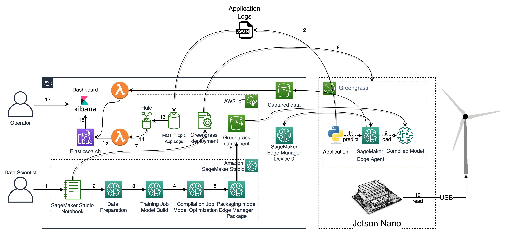

# SageMaker Edge Manager demo: Mini wind turbine farm
## A DIY project to explore ML@Edge with SageMaker

 > This repo is part of the blog post [Monitor and Manage Anomaly Detection Models on a fleet of Wind Turbines with Amazon SageMaker Edge Manager](https://aws.amazon.com/blogs/machine-learning/monitor-and-manage-anomaly-detection-models-on-a-fleet-of-wind-turbines-with-amazon-sagemaker-edge-manager/). If you want to implement the full solution, please follow the configuration steps described in the blog post and prepare your AWS account.

> We just added instructions to deploy the models to the devices using AWS IoT Greengrass. Checkout the `greengrass` branch to try it out. 

**TL:DR**: [Mini 3D printed wind turbines - assembling instructions](ASSEMBLING.md)

**DISCLAIMER**: If you don't have a 3D printer or the skills to build your own fleet of wind turbines, don't worry. You can still run the application in demonstration mode. Also, there is a [SageMaker Edge Manager Workshop](https://github.com/aws-samples/amazon-sagemaker-edge-manager-workshop) where you will be able to run a similar experiment but with a Simulator! :)

In this project you'll see how to build a **Mini Wind Turbine Farm**, to experiment with Machine Learning (@ Edge). With a 3D printer and some electronic components you can create a mini Wind Turbine with sensors and a small generator. This project is not intended to be a real-life electricity generator. It's just a device for testing/experimenting real-time and low latency machine learning on edge devices. It was created to demonstrate the capabilities of Amazon SageMaker Edge Manager.

[Amazon SageMaker Edge Manager](https://aws.amazon.com/sagemaker/edge-manager/) allows you to optimize, secure, monitor, and maintain ML models on fleets of smart cameras, robots, personal computers, industrial equipments, mobile devices and more. Using [Amazon SageMaker Edge Manager](https://aws.amazon.com/sagemaker/edge-manager/), you can manage the lifecycle of each ML model on each device in your device fleets for up to thousands or millions of devices. The service provides a software **agent that runs on edge devices** and a management interface in the AWS console. 

Using a Machine Learning model (Autoencoder) you can analyze the turbine sensors data and detect anomalies. This technique is important to improve the maintenance process and reduce the operational cost. Click on the image bellow to see a video of the Wind Turbine Farm running.

<a href="https://aws-ml-blog.s3.amazonaws.com/artifacts/monitor-manage-anomaly-detection-model-wind-turbine-fleet-sagemaker-neo/wind_farm.mp4">
 </img>
</a>

### Solution architecture
This is the reference architecture of this solution. The idea is to use <a href="https://aws.amazon.com/sagemaker/">Amazon SageMaker</a> to train an [AutoEncoder](https://en.wikipedia.org/wiki/Autoencoder) using the Turbine sensors data. Each edge device (Jetson Nano) has a SageMaker Edge Agent (edge) running on it. The agents are connected to devices registered to a device fleet on SageMaker Edge Manager (cloud). Also, for each edge device there is an IoT Thing. This is required by [the application](/04_EdgeApplication/README.md) that runs on the edge device to send logs to the cloud and for the OTA model update mechanism. By using SageMaker Agent CaptureData, the application collects some metrics from the predictions and sends to an S3 bucket (via agent). Lambda functions process the model metrics from S3 and the app logs from the MQTT Topic and ingests it to Elasticsearch (optional). This data can then be visualized using Kibana.

 </img>

### Step-by-step
In this repo you'll find instructions of how to build your mini 3D printed Wind Turbines. After that, follow the instructions on the blog post to configure your AWS Account and prepare your mini wind turbine farm. 

In summary, after configuring the your fleet of devices in your AWS Account, these are the steps you need to take to experiment with this solution. 

 </img>

  
 1. a data scientist uses SageMaker Studio to prepare a ML model;
 2. the sensors data is prepared: feature selection, cleaning, normalizing, etc.;
 3. using Pytorch, an autoencoder is trained;
 4. using SageMaker Neo, the model is compiled/optimized for Jetson Nano;
 5. using SageMaker Edge Manager, the model is signed and packed with the Jetson Nano runtime;
 6. the packaged is saved to an S3 bucket;
 7. the data scientist creates an IoT Job that sends a notification to the edge application;
 8. using an MQTT topic, which the applications is subscribed to, the message is sent to the edge device;
 9. the application receives a Json document with the model metadata through MQTT;
 10. the application receives the notification and downloads the model package from S3;
 11. the application unpacks the model to a local directory;
 12. the application invokes the agent API LoadModel to load the model (now the model is available to the application);
 13. the application reads some data from the sensors of the Wind Turbine;
 14. the application transform the data and invokes the model using the agent API Predict. Some model metrics are captured by the agent API CaptureData. A Lambda function that listens to that particular bucket, parses the metrics (Json lines) and ingests the data to Elasticsearch;
 15. some application logs are then sent to the cloud trough an MQTT topic;
 16. an IoT Rule reads the application logs;
 17. a lambda function, connected to the IoT Rule, parses the application logs;
 18. the parsed data is then ingested to Elasticsearch;
 19. both model metrics and application logs can be now accessd through Kibana;
 20. using kibana, the operator visualizes anomalies and other information;

### Notebooks
If you didn't configure your SageMaker Studio account yet, [please follow these instructions](https://docs.aws.amazon.com/sagemaker/latest/dg/onboard-quick-start.html) first. Then, clone this repo in Studio. You will run two notebooks there:
  1. [Dataset preparation](03_Notebooks/01%20-%20Data%20Preparation.ipynb): to transform (feature selection, cleaning, denoising, normalizing, etc) the sensors data (raw) into a dataset used to train the model
  2. [Model preparation](03_Notebooks/02%20-%20Training%20with%20Pytorch.ipynb): to train (Pytorch Autoencoder), compile, create a deployment package and notify the edge devices about the new model

### Edge Application
In [this directory](04_EdgeApplication) you'll find the Python application that runs on each Edge Device. Look for the term "the application" in the **Step-by-step** section to understand what it does. This is a custom/standalone application:

[Learn more about the edge application](/04_EdgeApplication)

### Assembling the turbines
Please, [follow the assembling instructions](ASSEMBLING.md).
