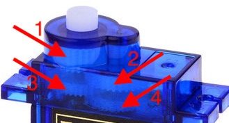
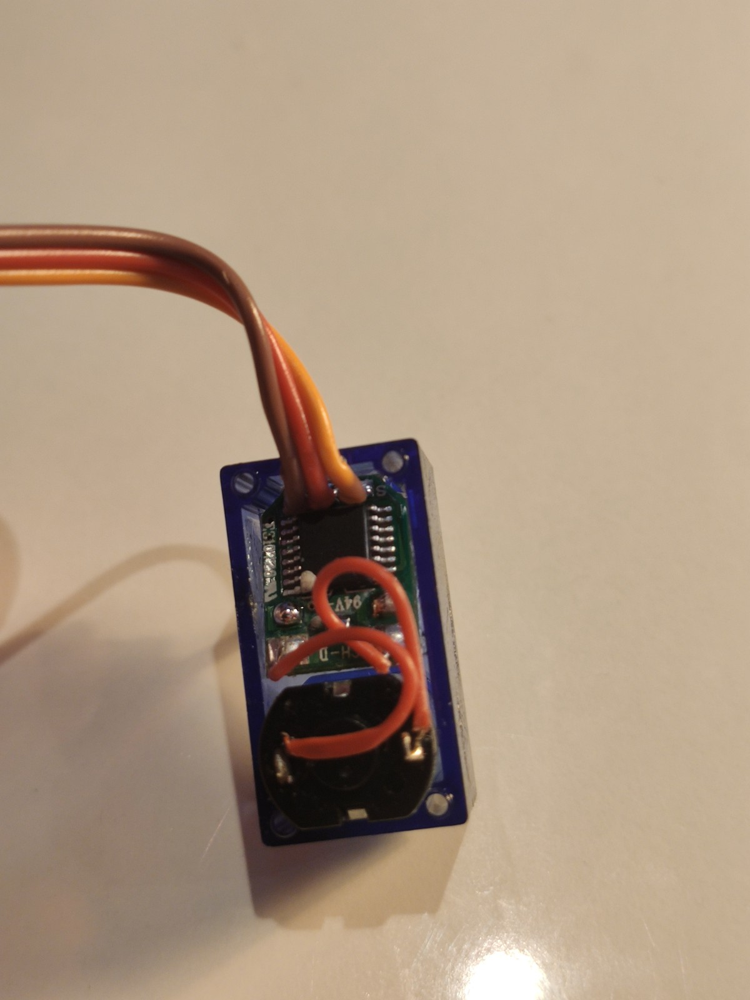
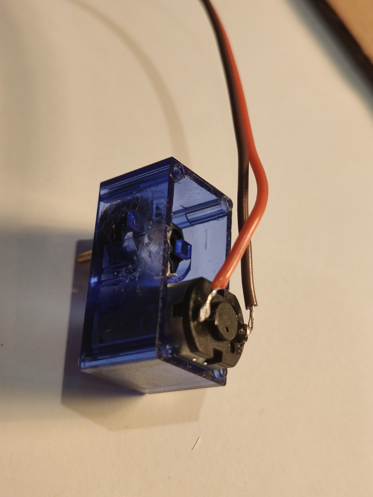
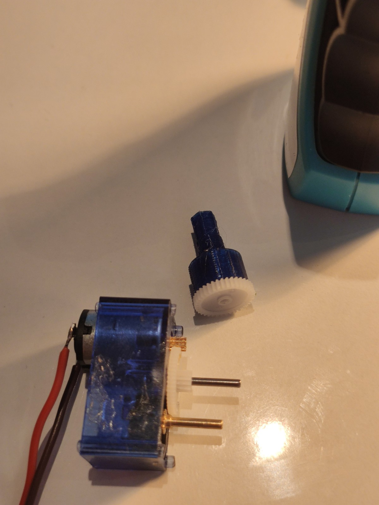
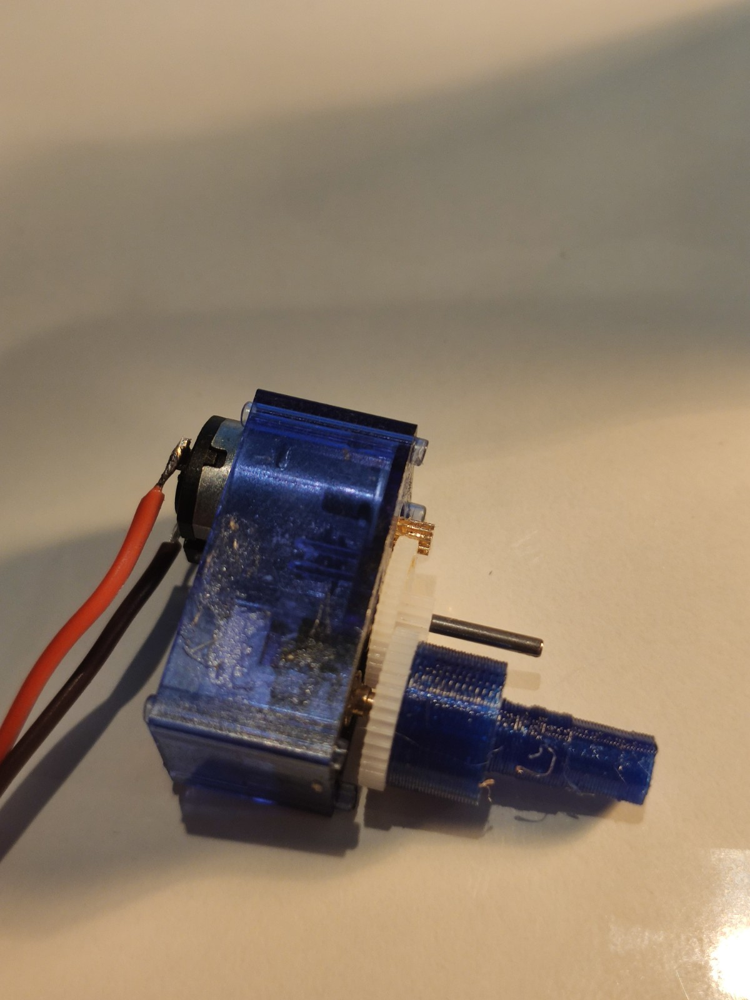
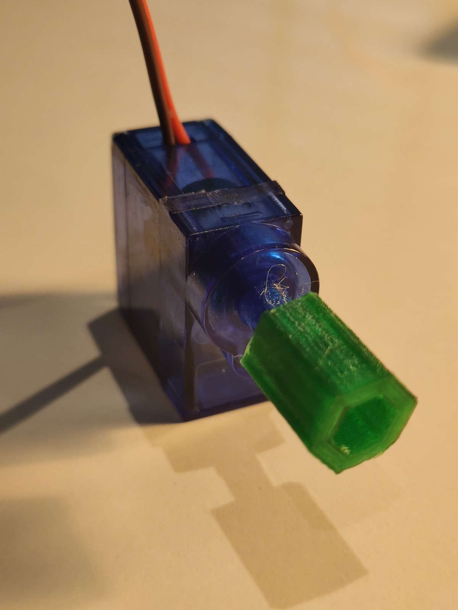

## Hacking a mini servo 9G to transform it into a small voltage generator

This a Servo normal servo 9G, composed by: a DC motor, a gearbox and a motor driver board. In order to use this device in the WindTurbine we need to hack it.
By hacking I mean to convert the servo into a simple Generator. 

   </img>   

The hack is basically the following steps:
 - 3D print the [Servo Shaft](01_3DModels/stl/big_shaft.stl) and the [Small Generator Connector](01_3DModels/stl/small_generator_connector.stl)
 - disassemble the servo
 - remove the shaft/gear and the second gear (#1 and #2 in the image bellow). Keep only the two gears close to the motor.
 - remove the driver board
 - solder back to the DC motor only positive and negative
 - remove the potentiometer upper part (you need to break it)
 - glue the Servo Shaft (with super glue) to gear #3 (image bellow)
 - put everything back to the case and close it
 - plug the **Small Generator Connector** to the **Servo Shaft**

 </img>

You can see the steps in the pictures bellow:
<table border="0" align="center">
    <tr>
      <td>
        </img>
      </td>
      <td>
        </img>
      </td>
      <td>
        </img>
      </td>
    </tr>
    <tr>
      <td>
        Open the servo and remove the driver board. Keep the cable.
      </td>
      <td>
        Solder the cable directly to the motor. Pay attention to the polarity.
      </td>
      <td>
        Keep gears 3 and 4 (check the image above) and glue gear 3 to the Servo shaft.
      </td>
    </tr>
    <tr>
      <td>
        </img>
      </td>
      <td>
        </img>
      </td>
      <td>
        </img>
      </td>
    </tr>
    <tr>
      <td>
        Remove (break & pull) the potentiometer to reduce the friction.
      </td>
      <td>
        Put the glued gear 3 back.
      </td>
      <td>
        Put the servo case back and attach the **Small Generator Connector** to the new Servo Shaft.
      </td>
    </tr>
</table>
